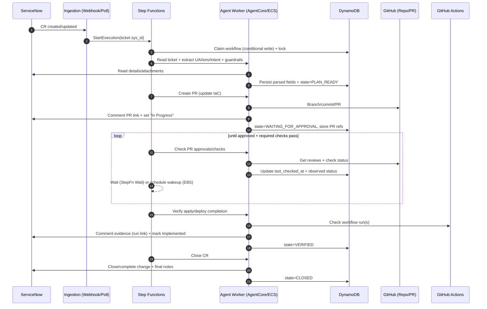

# Cloud Ops Agent – high-level plan, architecture, and flows

## Scope and goals

Automate ServiceNow **Incidents** and **Change Requests (CRs)** end-to-end:

- **Ingest** new/updated ServiceNow work items (webhook and/or polling).
- **Triage**: classify request type, extract UAI + environment + intent, apply guardrails.
- **Plan/execute**:
  - **Change**: map UAI → GitHub repo, update IaC, open PR, wait for approvals + CI apply, verify, update/close ServiceNow.
  - **Incident**: diagnose (CloudWatch/logs/SSM), remediate safely; if capacity/infra change needed, follow the IaC PR path then perform post-apply OS steps (SSM).
- **Track workflow state** in DynamoDB (idempotency, locks/leases, retries, audit trail).
- **Resume** long-running workflows (hours/days) using Step Functions waits and/or EventBridge Scheduler.

---

## AWS building blocks (recommended)

### Runtime (where the agent runs)

You can run the “Agent Worker” in either environment; the orchestration pattern stays the same.

- **Bedrock AgentCore runtime**
  - Good fit if your agent is primarily tool-calling and you want a managed agent runtime.
  - Still rely on Step Functions for deterministic state, waits, retries, and human gates.
- **ECS (service or tasks)**
  - Good fit if you need custom dependencies, tighter control over networking, or heavy non-LLM logic.
  - Typical split: small API for webhooks + worker(s) for step execution.

### Orchestration (recommended)

- **Step Functions**: source of truth for workflow progression, branching, retries, timeouts, and wait states.
- **EventBridge**:
  - Scheduled poller trigger (if polling ServiceNow).
  - Optional event bus for normalizing inbound triggers (webhook/poller) → start workflow.
- **EventBridge Scheduler (optional)**:
  - One-off “wake me up at time T” rechecks, if you prefer it to Step Functions `Wait`.

### State store

- **DynamoDB**: workflow record per ServiceNow ticket; includes locks/leases, idempotency keys, PR refs, and audit metadata.

---

## Operational model

### High-level workflow states (example)

- `RECEIVED`
- `TRIAGED`
- `REPO_MAPPED`
- `PLAN_READY`
- `PR_OPENED`
- `WAITING_FOR_APPROVAL`
- `WAITING_FOR_CI_APPLY`
- `POST_APPLY_STEPS` (optional; e.g., EBS resize filesystem grow)
- `VERIFIED`
- `CLOSED`
- Terminal/exception states: `NEEDS_HUMAN`, `BLOCKED`, `FAILED`, `CANCELLED`

### Guardrails (must-have)

- **Least privilege** per integration:
  - ServiceNow: read tickets + write comments/state for target queues.
  - GitHub: create branch/PR, read checks/reviews; no admin.
  - AWS: SSM RunCommand restricted by **instance tags**, **account/region**, and allowlisted documents/commands.
- **Policy layer**:
  - Auto-remediation allowlist (by incident type, severity, environment).
  - Change limits (ECS replicas bounds, instance type allowlist, EBS max size increase).
  - Human gates (CAB + PR approvals) for prod.
- **Idempotency & concurrency control**:
  - Conditional writes in DynamoDB for “claiming” tickets and preventing duplicate PRs / duplicated SSM actions.

---

## Data model (DynamoDB)

### Table: `cloudops_workflows` (suggested fields)

- **pk**: `SN#{table}#{sys_id}` (e.g., `SN#incident#<sys_id>`)
- **state**: string (one of the workflow states above)
- **lease_owner**, **lease_expires_at**: prevents concurrent runs
- **idempotency_key**: last processed trigger/event id (or computed hash per step)
- **ticket**: `{ table, sys_id, number, priority, assignment_group }`
- **uai**, **env**, **repo_url**
- **pr**: `{ number, url, branch, base, sha }`
- **ci**: `{ workflow_run_id, url, conclusion, updated_at }`
- **timestamps**: `created_at`, `updated_at`, `last_checked_at`
- **audit**: pointer to append-only events (optional separate table)

---

# Mermaid diagrams

## 1) High-level architecture (Step Functions + Agent runtime)

```mermaid
flowchart TB
  subgraph SN[ServiceNow]
    SNT[Incidents / Change Requests]
  end

  subgraph AWS[AWS]
    subgraph ING[Ingestion]
      APIGW[API Gateway (optional)]
      WH[Webhook Receiver\n(Lambda or ECS API)]
      POLL[Poller\n(EventBridge Schedule -> Lambda/ECS)]
      EB[EventBridge Bus (optional)]
    end

    subgraph ORCH[Orchestration]
      SF[Step Functions\nState Machine]
      EBS[EventBridge Scheduler\n(optional)]
    end

    subgraph RUNTIME[Agent execution]
      AR[Agent Worker\n(Bedrock AgentCore OR ECS)]
      MCP[MCP clients\n(ServiceNow/GitHub/AWS)]
    end

    DB[(DynamoDB\nWorkflow state + locks)]
    OBS[(Logs / Metrics / Tracing)]
  end

  subgraph GH[GitHub]
    REPO[Repo\n(IaC + app)]
    PR[Pull Request]
    GA[GitHub Actions\nPlan/Apply/Deploy]
  end

  subgraph EXEC[AWS execution plane]
    CW[CloudWatch\nLogs/Metrics]
    SSM[SSM RunCommand\n+ Session Manager]
    INFRA[Target Infra\n(ECS/EC2/EBS/etc.)]
  end

  SNT -->|Outbound REST webhook| APIGW --> WH --> EB
  SNT -->|Polling query| POLL --> EB
  EB -->|StartExecution| SF

  SF -->|Task invoke| AR
  AR <--> DB
  AR --> MCP

  MCP -->|Read/Update| SNT
  MCP -->|PR ops| REPO
  REPO --> PR --> GA
  GA -->|Applies changes| INFRA

  AR -->|Observe| CW
  AR -->|Diagnose/Remediate| SSM --> INFRA

  SF -->|Wait or schedule| EBS
  EBS -->|Wakeup| SF

  AR --> OBS
  SF --> OBS
```

---

## 2) Data flow: Change Request (IaC PR → approval → apply → close)



---

## 3) Data flow: Incident (diagnose → remediate via SSM OR IaC PR)

```mermaid
flowchart TD
  A[Incident created/updated] --> B[Start workflow\nclaim + lock in DynamoDB]
  B --> C[Classify incident\n(disk/CPU/memory/app errors)]

  C --> D[Diagnose\nCloudWatch + logs + safe SSM commands]
  D --> E{Auto-remediation allowed?}

  E -->|Yes| F[SSM remediation\n(purge temp, rotate logs, restart service)]
  F --> G[Verify\n(metrics/logs stabilize)]
  G --> H[Update ServiceNow\n(actions + evidence)]
  H --> I[Resolve/Close incident]

  E -->|No / capacity change needed| J[Create IaC PR\n(EBS size/instance type/ASG/etc.)]
  J --> K[Wait for approval + CI apply\n(StepFn waits/retries)]
  K --> L[Post-apply OS steps via SSM\n(grow partition/filesystem)]
  L --> G
```

---

# Implementation plan (high level)

## Ingestion

- **Webhook path**: ServiceNow outbound REST → API Gateway → Lambda/ECS → EventBridge → Step Functions.
- **Polling path**: EventBridge schedule → Lambda/ECS poller → EventBridge → Step Functions.
- **Idempotent claim**: Step Functions first step performs conditional put/update in DynamoDB.

## Step Functions responsibilities

- Control flow and branching (Incident vs Change).
- Retries/backoff for transient failures (API timeouts, rate limits).
- Wait/retry loops for PR approval/CI completion.
- Human gates (e.g., require explicit approval state before applying in prod).
- Timeout + escalation to `NEEDS_HUMAN`.

## Agent Worker responsibilities (AgentCore/ECS)

- Deterministic steps:
  - Read SN ticket, extract UAI/env/intent.
  - Repo resolution using UAI mapping.
  - IaC edit + PR creation.
  - GitHub status checks + evidence gathering.
  - AWS diagnosis/remediation (SSM) under strict allowlists.
  - SN updates (comments/state changes).

## Observability

- Structured logs with correlation id: `ticket_sys_id`, `workflow_execution_arn`, `state`.
- Metrics: tickets/hour, mean time in `WAITING_FOR_APPROVAL`, success/failure counts by type.
- Audit: store “what changed” links (PR, workflow run, SSM command id) back to SN and DynamoDB.
```
