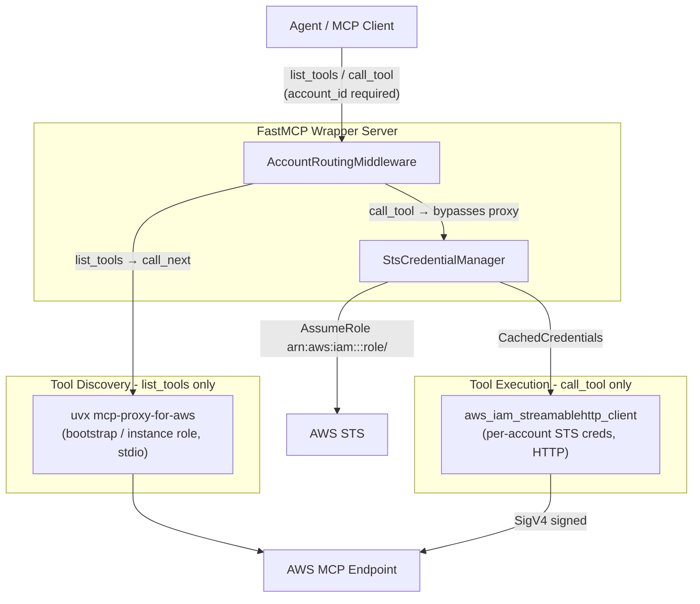

# AWS MCP Wrapper — Architecture & Plan

## Goal
A FastMCP server that mirrors the upstream AWS MCP tool surface and requires
`account_id` on every tool call. Each call is signed with temporary STS
credentials assumed for a fixed role in the target account, cached in memory
and refreshed near expiry. No allowlist file to maintain.

## Architecture



## Two-path design

| Operation | Path | Credentials |
|---|---|---|
| `list_tools` | FastMCP proxy → subprocess | Bootstrap / instance role |
| `call_tool` | Middleware → library mode client | Per-account STS AssumeRole |

The subprocess is a **persistent** process started at server startup with
fixed credentials. Credentials cannot change per request — this is why
library mode is used for `call_tool`, creating a fresh authenticated client
per call with just-resolved STS credentials.

## Per-call flow

```
Agent sends call_tool(tool_name, {account_id: "111122223333", ...})
  │
  └─ AccountRoutingMiddleware.on_call_tool()
       1. pop account_id from args
       2. validate format: must be 12 digits (^\d{12}$)
       3. StsCredentialManager.get("111122223333")
            → return cached CachedCredentials if is_fresh()
            → else STS AssumeRole on arn:aws:iam::111122223333:role/McpExecutionRole
            → store result in cache keyed by account_id
       4. call_upstream_tool(settings, creds, tool_name, stripped_args)
            → convert CachedCredentials → botocore.Credentials
            → aws_iam_streamablehttp_client(credentials=...)
            → ClientSession.initialize() + call_tool()
            → return CallToolResult
       5. on auth error (403/expired): invalidate cache entry → re-assume on next call
```

## File responsibilities

| File | Purpose |
|---|---|
| `config.py` | `Settings` (pydantic-settings, reads env + `.env`). No account map — role ARN constructed dynamically from `account_id` + `aws_role_name`. |
| `credentials.py` | `CachedCredentials` dataclass with `is_fresh()`. `StsCredentialManager` — constructs role ARN, per-account asyncio locks, in-memory cache, STS AssumeRole, `invalidate()`. |
| `upstream.py` | `call_upstream_tool()` — converts `CachedCredentials` to `botocore.Credentials`, calls `aws_iam_streamablehttp_client`, opens `ClientSession`, executes tool. |
| `middleware.py` | `AccountRoutingMiddleware` — `on_list_tools` injects `account_id` schema, `on_call_tool` validates format, resolves creds, routes, handles errors. |
| `server.py` | Wires everything: loads `Settings`, builds `FastMCP.as_proxy` with subprocess config, attaches middleware, runs Streamable HTTP server. |

## Credential lifecycle

```
first call for account X    → STS AssumeRole → cached (~1 hour TTL)
calls within refresh window → cache hit, no STS call
call within 5 min of expiry → STS AssumeRole again, cache refreshed
upstream returns 403        → cache invalidated → re-assumes on next call
```

## Security model

- The agent supplies only `account_id` (12-digit format validated).
- Role ARN is constructed server-side: `arn:aws:iam::<account_id>:role/<aws_role_name>`.
- The agent never controls which role ARN is assumed.
- Access is enforced by IAM:
  - The wrapper's execution role must have `sts:AssumeRole` on target roles.
  - Each target account's role must trust the wrapper's execution role.
- No `accounts.json` to maintain — adding a new account means only updating
  IAM trust policies in that account.

## Key design decisions

- No allowlist file: IAM trust policies are the security boundary.
- No `~/.aws` profile writes at runtime: all credential injection in memory.
- Per-account asyncio locks: no concurrent STS calls for the same account.
- Per-call MCP sessions (no persistent connections): correct for 400+ mostly-cold accounts.

## Configuration

Environment (see `.env.example`):

| Variable | Default | Notes |
|---|---|---|
| `AWS_MCP_ENDPOINT` | required | Upstream AWS MCP URL |
| `AWS_MCP_REGION` | `us-east-1` | SigV4 region |
| `AWS_MCP_SERVICE` | `None` | Inferred from URL if unset |
| `AWS_ROLE_NAME` | `McpExecutionRole` | Role assumed in every target account |
| `AWS_BOOTSTRAP_PROFILE` | `None` | Profile for tool discovery subprocess; uses instance role if unset |
| `STS_REFRESH_WINDOW_SECONDS` | `300` | Re-assume when less than this many seconds remain |
| `WRAPPER_HOST` | `0.0.0.0` | |
| `WRAPPER_PORT` | `8000` | |
| `WRAPPER_LOG_LEVEL` | `INFO` | |

## References

- mcp-proxy-for-aws: https://github.com/aws/mcp-proxy-for-aws
- FastMCP Proxy: https://gofastmcp.com/servers/providers/proxy
- FastMCP Middleware: https://gofastmcp.com/servers/middleware
- AWS MCP setup: https://docs.aws.amazon.com/agent-toolkit/latest/userguide/getting-started-aws-mcp-server.html
